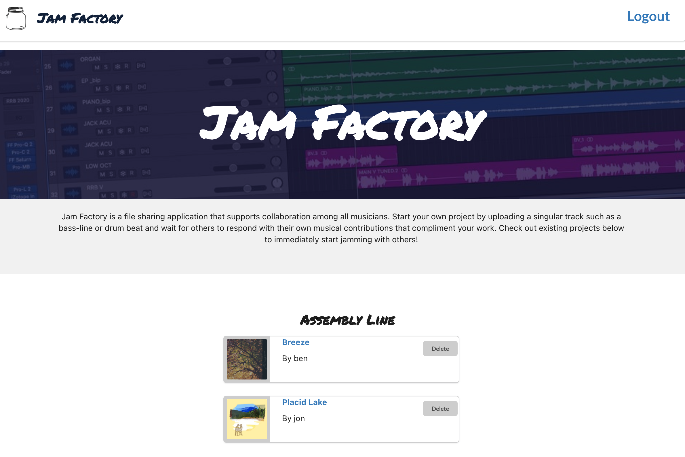
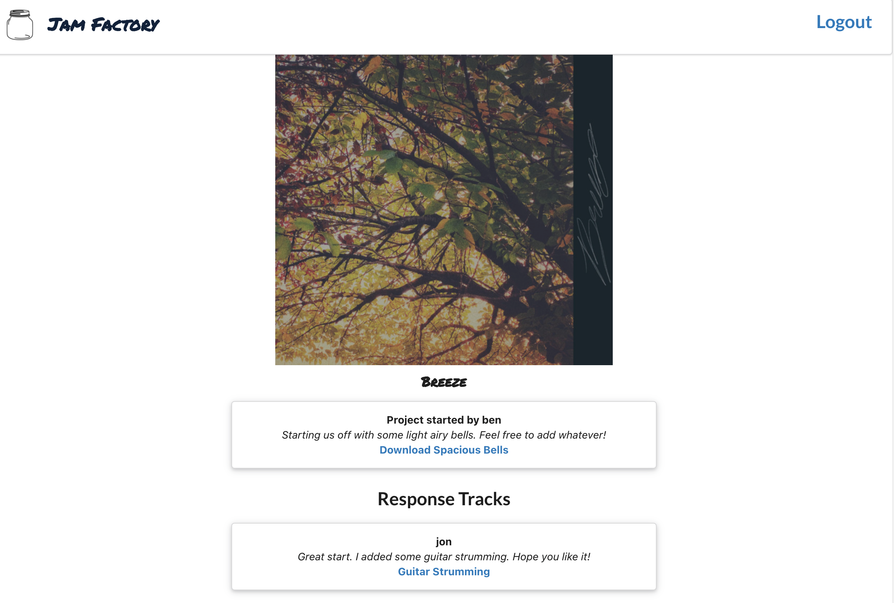

# Jam Factory

Jam Factory is a file sharing application for musicians. Users can start their own musical project by uploading a starter track (such as a guitar riff) and cover art image. Others can download tracks from existing projects and add their own tracks to build cohesive songs with one another. 

# ScreeenShots

 
 

# Technologies Used
* JavaScript
* React
* MongoDB
* Express
* NodeJS
* Amazon Web Services
* Html
* CSS

# Getting Started
[Launch App](https://jamfactory.herokuapp.com/)

# Next Steps
This project is considered a work in progess. I would like to redesign the user interface to include responsive buttons for showing/hiding forms. I'd also like to implement additional update and delete routes to give users more control. Finally I'd like to build a route to a user's profile page that can be accessed the project page.